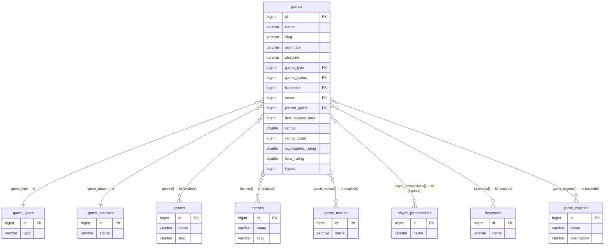
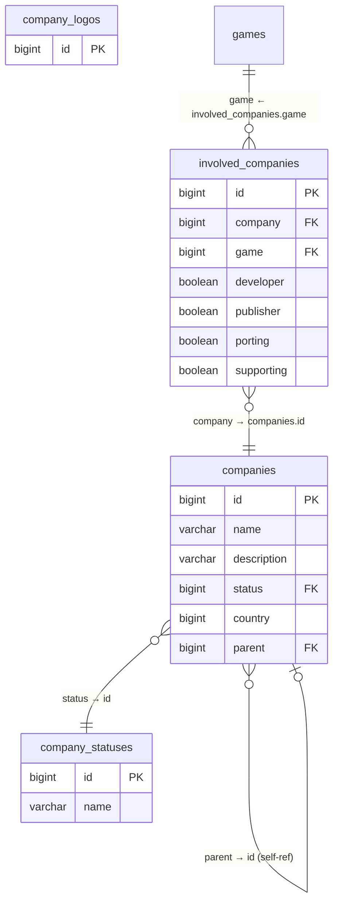
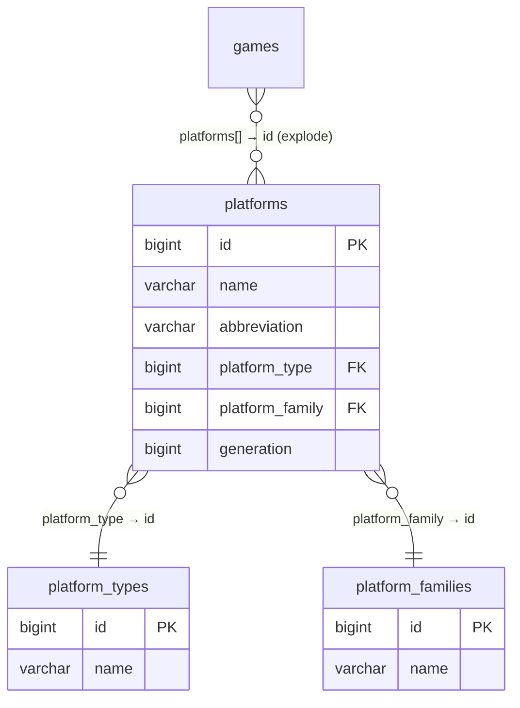
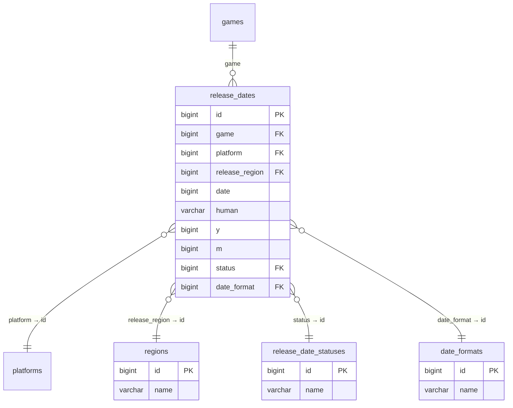
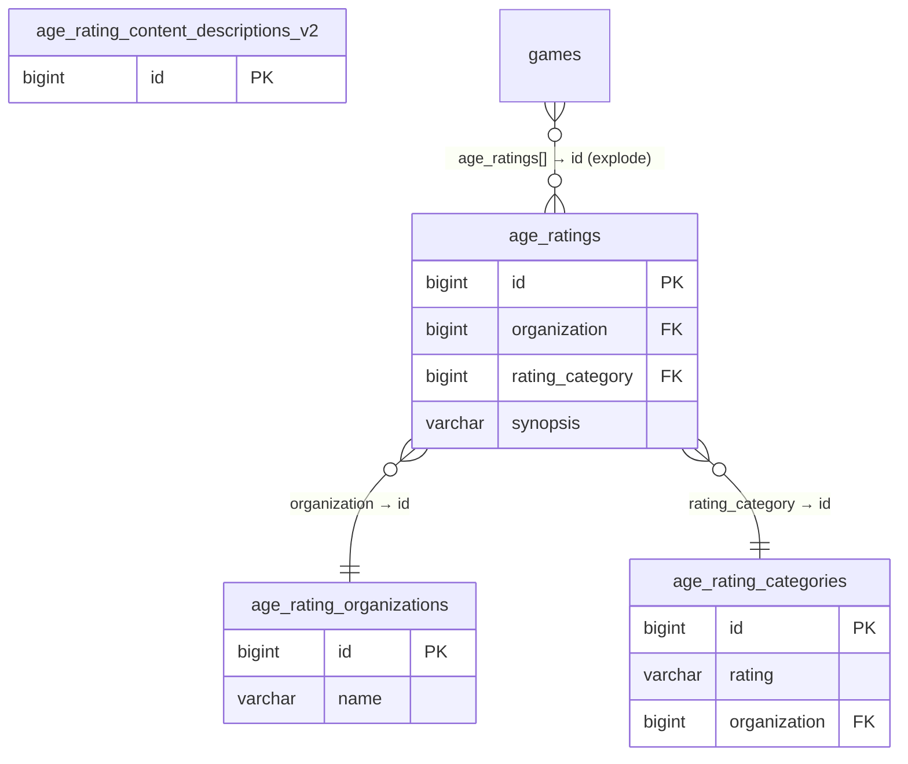
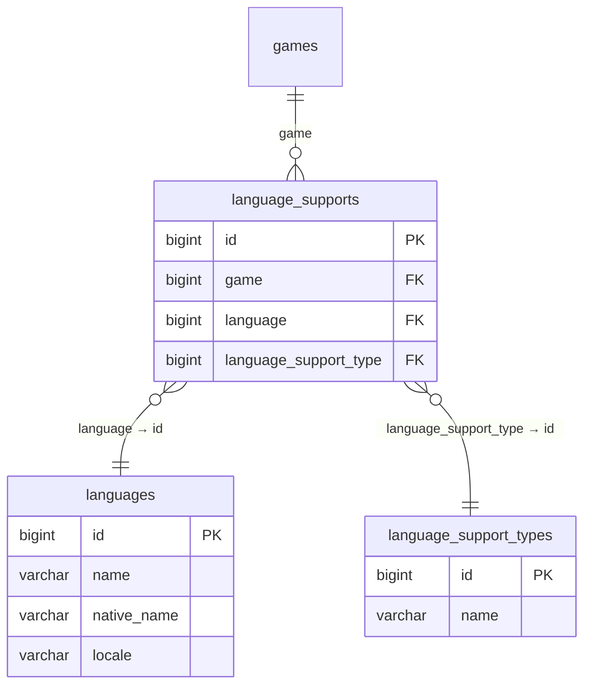
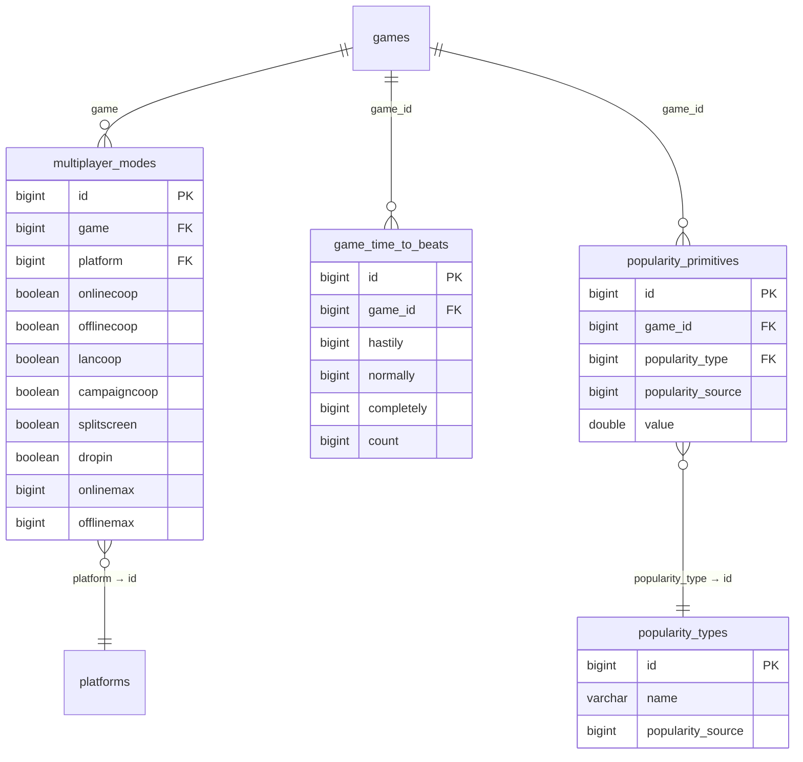
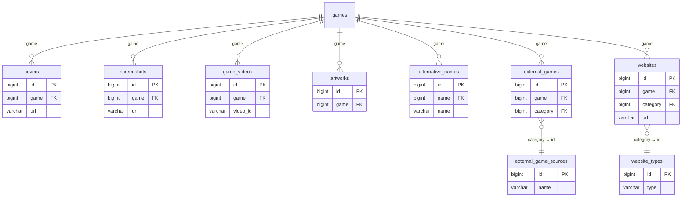
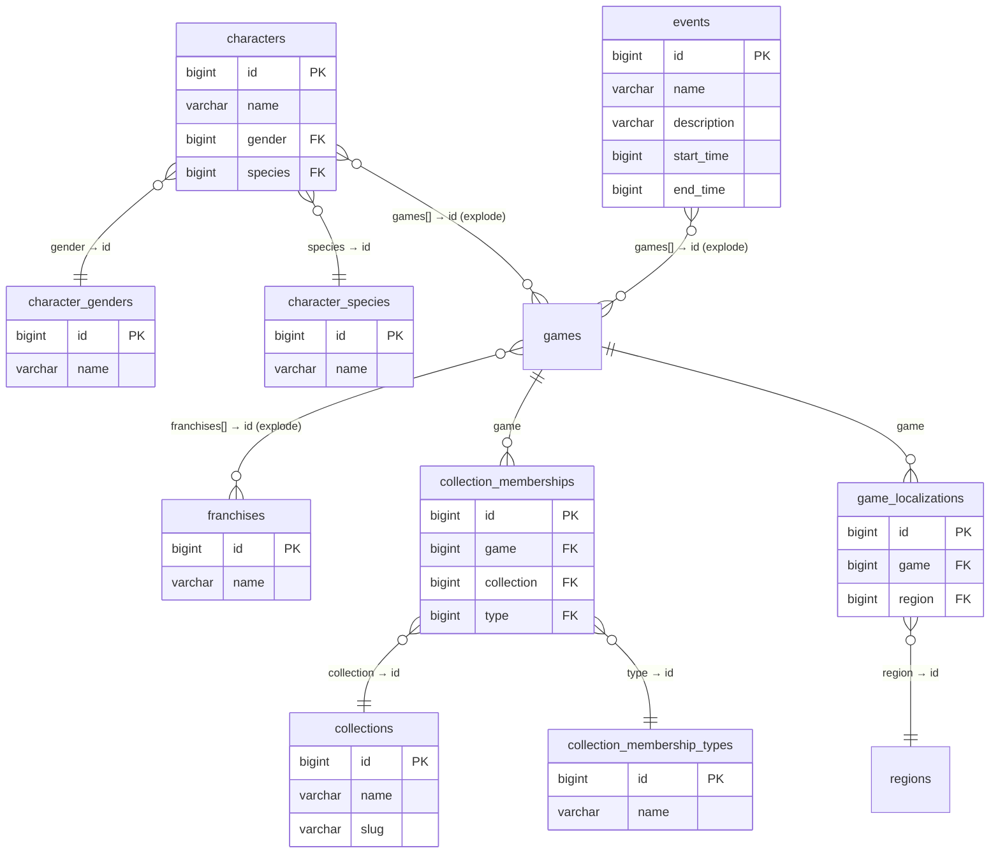

# 🎮 IGDB Silver Layer — Entity Relationship Diagram

> Schema: `games_analytics_silver` · Source: [IGDB API](https://api-docs.igdb.com/)

This document maps all Silver layer tables and their relationships. Diagrams use [Mermaid](https://mermaid.js.org/) and render natively on GitHub.

**Legend:**
- `PK` = Primary Key
- `FK` = Foreign Key (scalar bigint → lookup table)
- `array(bigint)` = Many-to-many relationship (requires `LATERAL VIEW explode()` in Spark SQL)
- Solid lines = direct FK joins
- `||--o{` = one-to-many · `}o--||` = many-to-one

---

## 📌 Overview

The `games` table is the **central hub** of the schema. Most of its columns are either scalar FKs to dimension/lookup tables or `array(bigint)` fields referencing related entities. The diagrams below are grouped by domain cluster for readability.

---

## 1. Core game entity

The `games` table connects to almost every other table in the schema — either through scalar FK columns or array columns that encode many-to-many relationships.



### Array fields on `games` (many-to-many, resolved via `explode()`)

| Column | Target Table | Join |
|--------|-------------|------|
| `genres[]` | `genres` | `explode(g.genres) → genres.id` |
| `themes[]` | `themes` | `explode(g.themes) → themes.id` |
| `platforms[]` | `platforms` | `explode(g.platforms) → platforms.id` |
| `game_modes[]` | `game_modes` | `explode(g.game_modes) → game_modes.id` |
| `player_perspectives[]` | `player_perspectives` | `explode(g.player_perspectives) → player_perspectives.id` |
| `keywords[]` | `keywords` | `explode(g.keywords) → keywords.id` |
| `game_engines[]` | `game_engines` | `explode(g.game_engines) → game_engines.id` |
| `age_ratings[]` | `age_ratings` | `explode(g.age_ratings) → age_ratings.id` |
| `involved_companies[]` | `involved_companies` | `explode(g.involved_companies) → involved_companies.id` |
| `release_dates[]` | `release_dates` | `explode(g.release_dates) → release_dates.id` |
| `language_supports[]` | `language_supports` | `explode(g.language_supports) → language_supports.id` |
| `multiplayer_modes[]` | `multiplayer_modes` | `explode(g.multiplayer_modes) → multiplayer_modes.id` |
| `dlcs[]` | `games` | self-referencing |
| `expansions[]` | `games` | self-referencing |
| `remakes[]` | `games` | self-referencing |
| `remasters[]` | `games` | self-referencing |
| `similar_games[]` | `games` | self-referencing |
| `franchises[]` | `franchises` | `explode(g.franchises) → franchises.id` |
| `collections[]` | `collections` | `explode(g.collections) → collections.id` |

---

## 2. Companies and involvement

The `involved_companies` table is the **bridge** between `games` and `companies`, with boolean flags indicating each company's role.



---

## 3. Platforms

Platform hierarchy with type and family dimension tables.



---

## 4. Release dates

Per-game, per-platform, per-region release information.



---

## 5. Age ratings

Content rating per organization (ESRB, PEGI, CERO, etc.).



---

## 6. Localization

Language support per game, qualified by support type (audio, subtitles, interface).



---

## 7. Multiplayer, time-to-beat and popularity

Gameplay metadata: multiplayer capabilities, completion times, and popularity metrics.



---

## 8. Media and content

Child tables for visual assets, alternative names, external links, and website references.



---

## 9. Collections, franchises, characters and events

Grouping entities: franchises own game arrays, collections use a membership bridge table, characters and events link to games via arrays.



---

## 📊 Table count summary

| Domain | Tables | Role |
|--------|--------|------|
| Core game entity | 9 | Hub + lookup dimensions |
| Companies | 4 | Bridge + company master |
| Platforms | 3 | Hierarchy with type/family |
| Release dates | 4 | Per-game per-platform releases |
| Age ratings | 3 | Content rating per org |
| Localization | 3 | Language support matrix |
| Multiplayer & gameplay | 4 | Co-op, time-to-beat, popularity |
| Media & content | 8 | Assets, links, external refs |
| Collections & groups | 9 | Franchises, characters, events |
| **Total** | **47** | |

---

## 🔧 Spark SQL notes

Since IGDB stores many-to-many relationships as `array(bigint)` columns on the `games` table, you must use `LATERAL VIEW explode()` to flatten them before joining:

```sql
-- Example: resolve genre names for each game
SELECT g.id, g.name, ge.name AS genre_name
FROM games_analytics_silver.games g
LATERAL VIEW explode(g.genres) AS genre_id
JOIN games_analytics_silver.genres ge ON ge.id = genre_id
```

> ⚠️ In Spark SQL, you **cannot** place a `JOIN` immediately after a `LATERAL VIEW`. Wrap the explode in a subquery first, then join the lookup table to the subquery result.