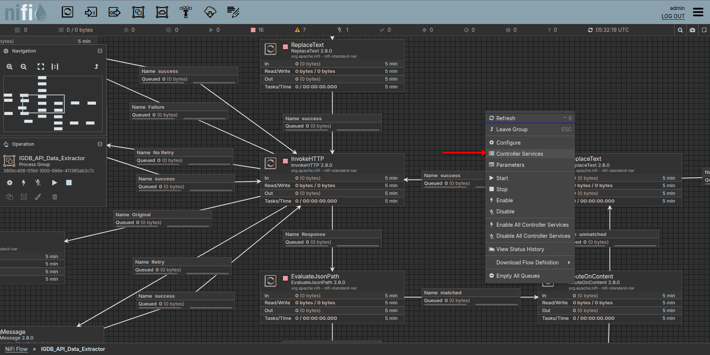
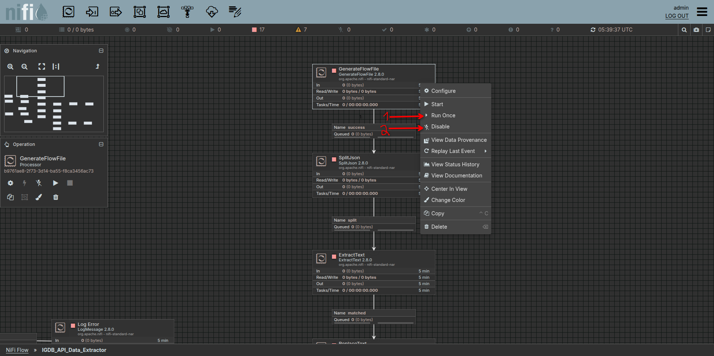
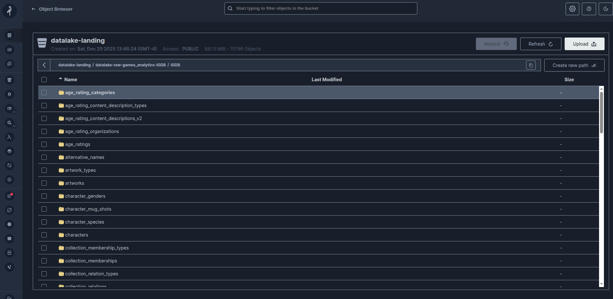

# IGDB Game Analytics Pipeline

End-to-end data pipeline that extracts video game data from the [IGDB API](https://api-docs.igdb.com), processes it through a **Medallion Architecture** (Bronze → Silver → Gold), and serves analytics-ready tables for dashboarding in Metabase.

Built with **Apache NiFi**, **Apache Airflow**, **Apache Spark + Delta Lake**, **MinIO**, and **Unity Catalog**.

---

## Data Diagram

See the full Silver layer Entity Relationship Diagram → [IGDB Silver Layer ERD](IGDB_SILVER_LAYER_ERD.md)

## Architecture

```
IGDB REST API
     │
     ▼
┌──────────┐     ┌────────────────────────────────────────────────┐
│  Apache   │     │              Apache Spark + Delta Lake         │
│   NiFi    │────▶│  Landing ──▶ Bronze ──▶ Silver ──▶ Gold       │
│ (Ingest)  │     │  (JSON)     (raw)     (clean)   (analytics)   │
└──────────┘     └────────────────────────────────────────────────┘
                        │            Orchestrated by Airflow            │
                        └───────────────────────────────────────────────┘
                                          │
                                          ▼
                                 ┌──────────────┐
                                 │   Metabase    │
                                 │  Dashboards   │
                                 └──────────────┘

Storage: MinIO (S3-compatible)    Catalog: Unity Catalog
```

## Data Layers

| Layer | Tables | Description |
|-------|--------|-------------|
| **Bronze** | 71 | Raw JSON ingested as-is into Delta Lake with schema inference |
| **Silver** | 71 | Cleaned and normalized — timestamp conversions, rating rounding, deduplication |
| **Gold** | 10 | Analytics-grade aggregations with complex joins and business logic |

### Gold Analytics Tables

| Table | What It Answers |
|-------|----------------|
| `game_catalog_enriched` | Enriched game profiles with genres, themes, platforms, modes, and content counts (DLCs, expansions, remakes) |
| `company_scorecard` | Developer/publisher performance — games developed, published, ported; average ratings and primary genre |
| `engine_adoption_trends` | Game engine usage over time — total games built, avg rating, platform reach |
| `genre_popularity_analysis` | Genre-level insights — game counts, ratings, hype, platform reach, time-to-beat |
| `platform_market_share` | Platform distribution — game counts, rating averages, release date ranges by generation |
| `release_timeline` | Temporal release patterns — monthly counts by platform and region |
| `franchise_performance` | Franchise analytics — best/worst titles, span years, DLC/expansion counts (2+ titles only) |
| `multiplayer_insights` | Multiplayer breakdown — coop types, max players, online/offline/LAN/split-screen |
| `localization_coverage` | Language support analysis — audio/subtitle/interface counts with coverage tiers |
| `game_content_scoring` | Age ratings and content classification by organization and category |

## Project Structure

```
.
├── airflow/
│   ├── dags/
│   │   ├── dag_igdb_raw_to_silver.py      # Orchestrates Raw → Bronze → Silver (71 tables)
│   │   └── dag_igdb_silver_to_gold.py      # Orchestrates Silver → Gold (10 tables)
│   └── spark/
│       ├── params/process/
│       │   ├── silver/igdb/                # 71 JSON configs (schema, transforms, PK)
│       │   └── gold/igdb/                  # 10 JSON configs (SQL queries, output schema)
│       ├── run_silver_settings_job.py      # Spark job runner for Silver layer
│       └── run_gold_settings_job.py        # Spark job runner for Gold layer
├── nifi/
│   └── template/
│       ├── IGDB_API_Data_Extractor.json    # Main API extraction flow
│       └── IGDB_Metada_Ingestion.xml       # Metadata ingestion & conversion
└── metabase/
    ├── docker-compose.yml                  # Metabase deployment
    └── docker/metabase/Dockerfile          # Custom Metabase image
```

## How It Works

### 1. Ingestion (NiFi)

Two NiFi templates handle data extraction from the IGDB API:

- **IGDB_API_Data_Extractor** — Calls IGDB REST endpoints with OAuth authentication, writes JSON responses to the MinIO landing zone (`datalake-landing`)
- **IGDB_Metadata_Ingestion** — Ingests and converts metadata with JSON transformation and hash-based deduplication

**Requirements**: IGDB API credentials (OAuth Bearer token + Client-ID from [IGDB API Documentation](https://api-docs.igdb.com/#getting-started). If you want to use the templates available in this project, you'll need to follow the steps to create an account on IGDB.

**How to run**:

* Access the [Nifi Canvas](http://localhost:8443/nifi/)
* At the nifi UI, upload your nifi ProcessGroup `./nifi/template/*.json`
  
* Drag and drop to chose the uploaded template.
  
* Access the template double clicking at the group
* Set the parameter by right clicking on a blank space (optional, mostly of the projects already has their own parameters pre selected).
  
  
* On InvokeHttp, doble click it and create two essential properties (It is recommended to enable the sensitive data option. Don't forget, those credentials you get from https://api-docs.igdb.com/#getting-started.).
  
  ```
  Authorization: Bearer "Your Access Token",
  Client-ID: "Your Client-ID",
  ```

* Right click on a blank space and chose the "Controller Services" option and enable the controller.
  
  

* Because you want to run it once for the start dump: Right click at "GenerateFlowFile" and Run once it, then deactivate so it cant run again in the flow
  

* Left Click on a blank space to select all flow and start the proccess
  
* Wait and watch the proccess, you can also see the files beign ingested at your lading-bucket
  

### 2. Processing (Airflow + Spark)

Two Airflow DAGs orchestrate the Spark transformations:

**`dag_igdb_raw_to_silver`** — For each of the 71 tables, runs two sequential Spark jobs:
1. **Raw → Bronze**: Reads landing JSON, infers schema, writes Delta table with primary keys
2. **Bronze → Silver**: Applies SQL transformations (timestamp conversions, rating normalization, data cleaning)

**`dag_igdb_silver_to_gold`** — For each of the 10 gold tables, runs one Spark job:
1. **Silver → Gold**: Executes complex SQL with CTEs, multi-table joins, lateral view explosions, and window functions

All table configurations (schemas, transformations, SQL queries, primary keys) are declarative JSON files — no hardcoded logic in the DAGs.

### 3. Visualization (Metabase)

Metabase connects to the Gold layer tables via Trino/Unity Catalog to power interactive dashboards for game industry analytics.

## Key Datasets

The pipeline processes **71 IGDB entities** including:

- **Core**: Games, Franchises, Collections, Characters
- **Classification**: Genres, Themes, Keywords, Game Modes, Player Perspectives
- **Industry**: Companies, Platforms, Engines, Involved Companies
- **Content**: Artworks, Screenshots, Videos, Covers, Age Ratings
- **Localization**: Languages, Language Supports, Game Localizations
- **Temporal**: Release Dates, Game Versions, External Games
- **Gameplay**: Multiplayer Modes, Time to Beat

## Tech Stack

| Component | Technology |
|-----------|-----------|
| Data Source | IGDB REST API (Twitch/IGDB) |
| Ingestion | Apache NiFi |
| Orchestration | Apache Airflow |
| Processing | Apache Spark 3.x + Delta Lake |
| Storage | MinIO (S3-compatible object storage) |
| Data Catalog | Unity Catalog |
| Table Format | Delta Lake with UniForm (Iceberg compatibility) |
| Visualization | Metabase |

## Getting Started

### Prerequisites

- Docker & Docker Compose
- IGDB API credentials ([register here](https://api-docs.igdb.com/#account-creation))
- MinIO instance with `datalake` and `datalake-landing` buckets

### Setup

1. **NiFi**: Import the templates from `nifi/template/` and configure your IGDB API credentials and MinIO connection
2. **Airflow**: Deploy the DAGs and Spark configs — ensure `spark/params/` is mounted at `/opt/airflow/spark/params/`
3. **Run**: Trigger `dag_igdb_raw_to_silver` first, then `dag_igdb_silver_to_gold`
4. **Metabase**: Connect to the Gold layer and build your dashboards

## License

MIT
